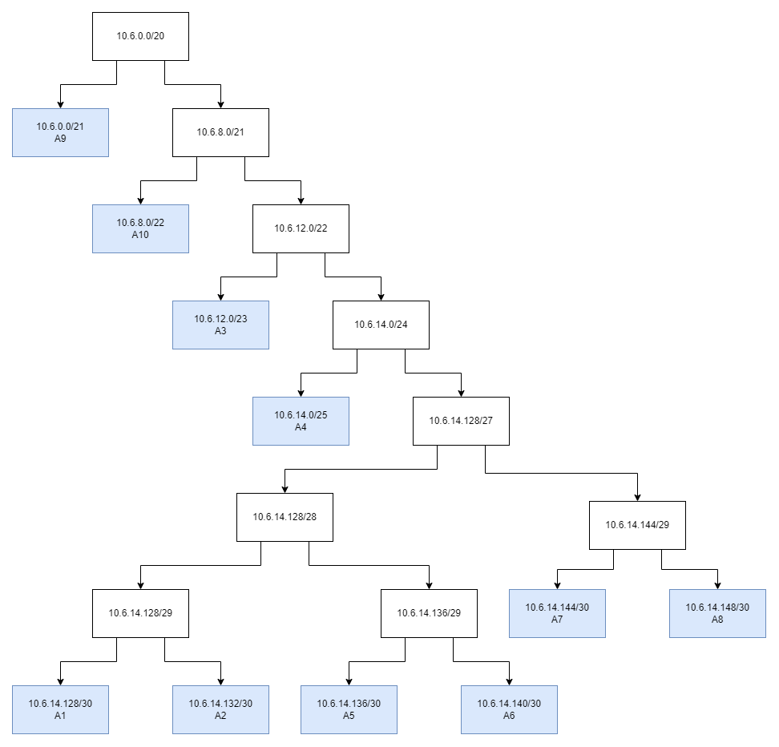
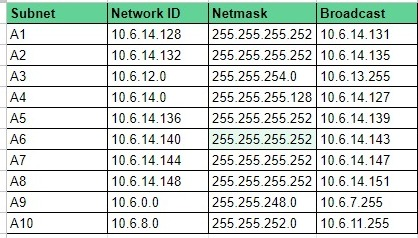
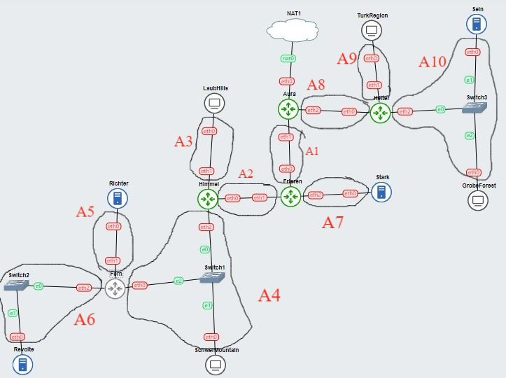

# Jarkom-Modul-5-A14-2023

## (A) Tugas pertama, buatlah peta wilayah sesuai berikut ini:
Berikut ini adalah daftar config yang digunakan  
<b>Aura</b>
```
auto eth0
iface eth0 inet static
	address 192.168.122.2
	netmask 255.255.255.252
	gateway 192.168.122.1

auto eth1
iface eth1 inet static
	address 10.6.14.129
	netmask 255.255.255.252

auto eth2
iface eth2 inet static
	address 10.6.14.149
	netmask 255.255.255.252
```

<b>Heiter</b>
```
auto eth0
iface eth0 inet static
	address 10.6.14.150
	netmask 255.255.255.252
	gateway 10.6.14.149

auto eth1
iface eth1 inet static
	address 10.6.0.1
	netmask 255.255.248.0

auto eth2
iface eth2 inet static
	address 10.6.8.1
	netmask 255.255.252.0
```

<b>TurkRegion</b>
```
auto eth0
iface eth0 inet dhcp
```

<b>Sein</b>
```
auto eth0
iface eth0 inet static
	address 10.6.8.2
	netmask 255.255.252.0
	gateway 10.6.8.1
```

<b>GrobeForest</b>
```
auto eth0
iface eth0 inet dhcp
```

<b>Frieren</b>
```
auto eth0
iface eth0 inet static
	address 10.6.14.130
	netmask 255.255.255.252
	gateway 10.6.14.129

auto eth1
iface eth1 inet static
	address 10.6.14.133
	netmask 255.255.255.252

auto eth2
iface eth2 inet static
	address 10.6.14.145
	netmask 255.255.255.252
```

<b>Stark</b>
```
auto eth0
iface eth0 inet static
	address 10.6.14.146
	netmask 255.255.255.252
	gateway 10.6.14.145
```

<b>Himmel</b>
```
auto eth0
iface eth0 inet static
	address 10.6.14.134
	netmask 255.255.255.252
	gateway 10.6.14.133

auto eth1
iface eth1 inet static
	address 10.6.12.1
	netmask 255.255.254.0

auto eth2
iface eth2 inet static
	address 10.6.14.1
	netmask 255.255.255.128
```

<b>LaubHills</b>
```
auto eth0
iface eth0 inet dhcp
```

<b>SchwerMountains</b>
```
auto eth0
iface eth0 inet dhcp
```

<b>Fern</b>
```
auto eth0
iface eth0 inet static
	address 10.6.14.2
	netmask 255.255.255.128
	gateway 10.6.14.1

auto eth1
iface eth1 inet static
	address 10.6.14.137
	netmask 255.255.255.252

auto eth2
iface eth2 inet static
	address 10.6.14.141
	netmask 255.255.255.252
```

<b>Richter</b>
```
auto eth0
iface eth0 inet static
	address 10.6.14.138
	netmask 255.255.255.252
	gateway 10.6.14.137
```

<b>Revolte</b>
```
auto eth0
iface eth0 inet static
	address 10.6.14.142
	netmask 255.255.255.252
	gateway 10.6.14.141
```

## (B) Untuk menghitung rute-rute yang diperlukan, gunakan perhitungan dengan metode VLSM. Buat juga pohonnya, dan lingkari subnet yang dilewati.
## (C) Kemudian buatlah rute sesuai dengan pembagian IP yang kalian lakukan. 
Berikut ini adalah tree dari hasil pembagian VLSM  
  
Berikut ini adalah daftar pembagian IP VLSM  
  
Berikut ini adalah penggambaran subnetting pada topologi dengan metode VLSM  
  
Berikut ini adalah daftar routing yang perlu dilakukan  
<b>Aura</b>
```
route add -net 10.6.12.0 netmask 255.255.252.0 gw 10.6.14.130 # A2 - A7
route add -net 10.6.0.0 netmask 255.255.248.0 gw 10.6.14.150 # A9
route add -net 10.6.8.0 netmask 255.255.252.0 gw 10.6.14.150 # A10
```

<b>Heiter</b>
```
route add -net 0.0.0.0 netmask 0.0.0.0 gw 10.6.14.149
```

<b>Frieren</b>
```
route add -net 0.0.0.0 netmask 0.0.0.0 gw 10.6.0.129
route add -net 10.6.12.0 netmask 255.255.254.0 gw 10.6.14.134 # A3
route add -net 10.6.14.0 netmask 255.255.255.128 gw 10.6.14.134 # A4
route add -net 10.6.14.136 netmask 255.255.255.248 gw 10.6.14.134 # A5 - A6
```

<b>Himmel</b>
```
route add -net 0.0.0.0 netmask 0.0.0.0 gw 10.6.0.133
route add -net 10.6.14.136 netmask 255.255.255.248 gw 10.6.14.2 # A5 - A6
```

<b>Fern</b>
```
route add -net 0.0.0.0 netmask 0.0.0.0 gw 10.6.14.1
```

## (D) Tugas berikutnya adalah memberikan ip pada subnet SchwerMountain, LaubHills, TurkRegion, dan GrobeForest menggunakan bantuan DHCP.
Pada server DNS (Richter), jalankan perintah berikut untuk menginstall server dhcp dan mengaturnya  
```
apt-get update
apt-get install isc-dhcp-server -y
echo 'option domain-name "example.org";
option domain-name-servers ns1.example.org, ns2.example.org;

default-lease-time 20000;
max-lease-time 50000;

ddns-update-style none;

authoritative;

subnet 10.6.14.128 netmask 255.255.255.252{
}
subnet 10.6.14.132 netmask 255.255.255.252{
}
subnet 10.6.12.0 netmask 255.255.254.0{
    range 10.6.12.2 10.6.13.254;
    option routers 10.6.12.1;
    option broadcast-address 10.6.13.255;
    option domain-name-servers 10.6.14.138;
}
subnet 10.6.14.0 netmask 255.255.255.128{
    range 10.6.14.3 10.6.14.126;
    option routers 10.6.14.1;
    option broadcast-address 10.6.14.127;
    option domain-name-servers 10.6.14.138;
}
subnet 10.6.14.136 netmask 255.255.255.252{
}
subnet 10.6.14.140 netmask 255.255.255.252{
}
subnet 10.6.14.144 netmask 255.255.255.252{
}
subnet 10.6.14.148 netmask 255.255.255.252{
}
subnet 10.6.0.0 netmask 255.255.248.0{
    range 10.6.0.2 10.6.7.254;
    option routers 10.6.0.1;
    option broadcast-address 10.6.7.255;
    option domain-name-servers 10.6.14.138;
}
subnet 10.6.8.0 netmask 255.255.252.0{
    range 10.6.8.3 10.6.11.254;
    option routers 10.6.8.1;
    option broadcast-address 10.6.11.255;
    option domain-name-servers 10.6.14.138;
}

' > /etc/dhcp/dhcpd.conf
service isc-dhcp-server restart
```
Pada semua router (Aura,Heiter, Frieren, Himmel, dan Fern), jalankan perintah berikut untuk menginstall relay dhcp dan mengaturnya
```
apt-get update
apt-get install isc-dhcp-relay -y
echo 'SERVERS="10.6.14.142"
INTERFACES="eth0 eth1 eth2"
OPTIONS=""
' > /etc/default/isc-dhcp-relay
echo 'net.ipv4.ip_forward=1' > /etc/sysctl.conf
service isc-dhcp-relay start
```

## 1 Agar topologi yang kalian buat dapat mengakses keluar, kalian diminta untuk mengkonfigurasi Aura menggunakan iptables, tetapi tidak ingin menggunakan MASQUERADE.
Pada Aura, jalankan perintah berikut
```
iptables -t nat -A POSTROUTING -o eth0 -j SNAT -s 10.6.0.0/20 --to-source 192.168.122.2
```
Kemudian, pada seluruh node lainnya jalankan perintah berikut
```
echo "nameserver 192.168.122.1" > /etc/resolv.conf
```

## 2 Kalian diminta untuk melakukan drop semua TCP dan UDP kecuali port 8080 pada TCP.
Pada semua node, jalankan perintah berikut
```
iptables -N NO_2
iptables -A NO_2 -p tcp -m multiport ! --dport 8080 -j DROP
iptables -A NO_2 -p udp -j DROP
iptables -A INPUT -j NO_2
```
Perintah pertama akan membuat chain baru yaitu NO_2  
Perintah kedua akan mendrop semua paket tcp yang bukan pada port 8080  
Perintah ketiga akan mendrop semua paket udp  
Perintah keempat akan menambahkan chain NO_2 ke chain INPUT, sehingga perintah kedua dan ketiga akan dijalankan ketika ada paket yang masuk ke node
## 3 Kepala Suku North Area meminta kalian untuk membatasi DHCP dan DNS Server hanya dapat dilakukan ping oleh maksimal 3 device secara bersamaan, selebihnya akan di drop.
Pada Richter dan Revolte, jalankan perintah berikut  
```
iptables -N NO_3
iptables -A NO_3 -p icmp --icmp-type echo-request -m conntrack --ctstate RELATED,ESTABLISHED -j ACCEPT
iptables -A NO_3 -p icmp --icmp-type echo-request -m connlimit --connlimit-above 3 --connlimit-mask 0 -j DROP
iptables -A INPUT -j NO_3
```
Perintah pertama akan membuat chain baru yaitu NO_3  
Perintah kedua akan menerima koneksi ICMP echo-request (ping) dari IP yang sebelumnya sudah membentuk koneksi, dengan perintah ini maka  client ke-4 melakukan ping, 3 client pertama tetap dapat melakukan ping  
Perintah ketiga akan mendrop semua paket ICMP echo-request (ping) dari koneksi keempat / lebih  
Perintah keempat akan menambahkan chain NO_3 ke chain INPUT sehingga perintah kedua dan ketiga akan dijalankan ketika ada paket yang masuk ke node  

## 4 Lakukan pembatasan sehingga koneksi SSH pada Web Server hanya dapat dilakukan oleh masyarakat yang berada pada GrobeForest.
Pada node Web Server (Sein, Stark), jalankan perintah berikut
```
iptables -N NO_4
iptables -A NO_4 -p tcp --dport 22 -m iprange ! --src-range 10.6.8.3-10.6.11.254 -j DROP
iptables -A INPUT -j NO_4
```
Perintah pertama akan membuat chain baru yaitu NO_4  
Perintah kedua akan mendrop semua paket tcp di port 22 yang bukan berasal dari 10.6.8.3 hingga 10.6.11.254, yang merupakan kemungkinan range IP dari GrobeForest  
Perintah ketiga akan menambahkan chain NO_3 ke chain INPUT, sehingga perintah kedua akan dijalankan ketika ada paket yang masuk ke node  

## 5 Selain itu, akses menuju WebServer hanya diperbolehkan saat jam kerja yaitu Senin-Jumat pada pukul 08.00-16.00.
Pada node Web Server (Sein, Stark), jalankan perintah berikut
```
iptables -N NO_5
iptables -A NO_5 -m time --weekdays Sat,Sun -j DROP
iptables -A NO_5 -m time --weekdays Mon,Tue,Wed,Thu,Fri --timestart 00:00 --timestop 07:59 -j DROP
iptables -A NO_5 -m time --weekdays Mon,Tue,Wed,Thu,Fri --timestart 16:01 --timestop 23:59 -j DROP
iptables -A INPUT -j NO_5
```
Perintah pertama akan membuat chain baru yaitu NO_5  
Perintah kedua akan mendrop semua paket yang berasal dari ketika dikirim pada hari libur (Sabtu dan Minggu)  
Perintah ketiga akan mendrop semua paket yang berasal dari ketika dikirim pada hari kerja (Senin, Selasa, Rabu, Kamis, dan Jumat) pada waktu 00:00 hingga 07:59  
Perintah keempat akan mendrop semua paket yang berasal dari ketika dikirim pada hari kerja (Senin, Selasa, Rabu, Kamis, dan Jumat) pada waktu 16:01 hingga 23:59  
Perintah kelima akan menambahkan chain NO_5 ke chain INPUT, sehingga perintah kedua hingga keempat akan dijalankan ketika ada paket yang masuk ke node  

Perintah yang digunakan agak kurang efisien, akan tetapi diperlukan pendekatan ini agar dapat dilakukan logging (no 10)  

## 6 Lalu, karena ternyata terdapat beberapa waktu di mana network administrator dari WebServer tidak bisa stand by, sehingga perlu ditambahkan rule bahwa akses pada hari Senin - Kamis pada jam 12.00 - 13.00 dilarang (istirahat maksi cuy) dan akses di hari Jumat pada jam 11.00 - 13.00 juga dilarang (maklum, Jumatan rek).
Pada node Web Server (Sein, Stark), jalankan perintah berikut
```
iptables -N NO_6
iptables -A NO_6 -m time --timestart 12:00 --timestop 13:00 --weekdays Mon,Tue,Wed,Thu -j DROP
iptables -A NO_6 -m time --timestart 11:00 --timestop 13:00 --weekdays Fri -j DROP
iptables -A INPUT -j NO_6
```
Perintah pertama akan membuat chain baru yaitu NO_6  
Perintah kedua akan mendrop semua paket yang berasal dari ketika dikirim pada hari Senin, Selasa, Rabu dan Kamis pada jam 12:00 hingga 13:00    
Perintah ketiga akan mendrop semua paket yang berasal dari ketika dikirim pada hari Jumat pada jam 11:00 hingga 13:00  
Perintah keempat akan menambahkan chain NO_5 ke chain INPUT, sehingga perintah kedua dan ketiga akan dijalankan ketika ada paket yang masuk ke node  

## 7 Karena terdapat 2 WebServer, kalian diminta agar setiap client yang mengakses Sein dengan Port 80 akan didistribusikan secara bergantian pada Sein dan Stark secara berurutan dan request dari client yang mengakses Stark dengan port 443 akan didistribusikan secara bergantian pada Sein dan Stark secara berurutan.
Pada node Heiter, jalankan perintah berikut
```
iptables -t nat -N NO_7
iptables -A NO_7 -t nat -p tcp --dport 80 -d 10.6.8.2 -m statistic --mode nth --every 2 --packet 0 -j DNAT --to-destination 10.6.8.2
iptables -A NO_7 -t nat -p tcp --dport 80 -d 10.6.8.2 -j DNAT --to-destination 10.6.14.146
iptables -t nat -A PREROUTING -j NO_7
```
Perintah pertama akan membuat chain baru yaitu NO_7 pada tabel NAT  
Perintah kedua akan meredirect paket nomor ganjil yang menuju Sein pada port 80 menuju Sein  
Perintah ketiga akan meredirect paket yang menuju Sein pada port 80 dan tidak diredirect sebelumnya (paket bernomor ganjil) menuju Stark port 80  
Perintah keempat akan menambahkan chain NO_7 ke chain PREROUTING pada tabel NAT, sehingga perintah kedua dan ketiga akan dijalankan sebelum dilakukan proses routing pada node tersebut  

Pada node Frieren, jalankan perintah berikut
```
iptables -t nat -N NO_7
iptables -A NO_7 -t nat -p tcp --dport 443 -d 10.6.8.2 -m statistic --mode nth --every 2 --packet 0 -j DNAT --to-destination 10.6.8.2
iptables -A NO_7 -t nat -p tcp --dport 443 -d 10.6.8.2 -j DNAT --to-destination 10.6.14.146
iptables -t nat -A PREROUTING -j NO_7
```
Perintah pertama akan membuat chain baru yaitu NO_7 pada tabel NAT  
Perintah kedua akan meredirect paket nomor ganjil yang menuju Stark pada port 443 menuju Sein  
Perintah ketiga akan meredirect paket yang menuju Sein pada port 443 dan tidak diredirect sebelumnya (paket bernomor ganjil) menuju Stark port 443  
Perintah keempat akan menambahkan chain NO_7 ke chain PREROUTING pada tabel NAT, sehingga perintah kedua dan ketiga akan dijalankan sebelum dilakukan proses routing pada node tersebut  

## 8 Karena berbeda koalisi politik, maka subnet dengan masyarakat yang berada pada Revolte dilarang keras mengakses WebServer hingga masa pencoblosan pemilu kepala suku 2024 berakhir. Masa pemilu (hingga pemungutan dan penghitungan suara selesai) kepala suku bersamaan dengan masa pemilu Presiden dan Wakil Presiden Indonesia 2024.
Pada node Frieren, jalankan perintah berikut
```
iptables -N NO_8
iptables -A NO_8 -s 10.6.14.140/30 -d 10.6.8.2 -m time --datestop 2024-06-27 -j DROP
iptables -A NO_8 -s 10.6.14.140/30 -d 10.6.14.146 -m time --datestop 2024-06-27 -j DROP
iptables -A FORWARD -j NO_8
```
Perintah pertama akan membuat chain baru yaitu NO_8  
Perintah kedua akan mendrop semua paket dari subnet Revolte (10.6.14.140/30) yang menuju Sein sebelum masa akhir perhitungan suara (27 Juni 2024)  
Perintah ketiga akan mendrop semua paket dari subnet Revolte (10.6.14.140/30) yang menuju Stark sebelum masa akhir perhitungan suara (27 Juni 2024)  
Perintah keempat akan menambahkan chain NO_8 ke chain FORWARD, sehingga semua paket yang melalui node akan diberlakukan perintah kedua dan ketiga  

## 9 Sadar akan adanya potensial saling serang antar kubu politik, maka WebServer harus dapat secara otomatis memblokir  alamat IP yang melakukan scanning port dalam jumlah banyak (maksimal 20 scan port) di dalam selang waktu 10 menit.
Pada node Web Server (Sein dan Stark), jalankan perintah berikut
```
iptables -N NO_9
iptables -A NO_9 -m recent --name scan --update --seconds 600 --hitcount 20 -j DROP
iptables -A NO_9 -m recent --name scan --set -j ACCEPT
iptables -A INPUT -j NO_9
```
Perintah pertama akan mebuat chain baru yaitu NO_9  
Perintah kedua akan mendrop semua paket yang berasal dari IP yang telah melakukan 20 port scanning dalam selang waktu 600 detik / 10 menit, jumlah scanning dilihat pada sebuah set scan yang dimasukkan isinya pada perintah ketiga    
Perintah ketiga akan menambahkan IP yang melakukan port scanning ke set bernama scan untuk menghitung jumlah port scanning yang dilakukan  
Perintah keempat akan menambahkan chain NO_9 ke chain INPUT, sehinga perintah kedua dan ketiga akan dijalankan ketika ada paket yang masuk ke node  

## 10 Karena kepala suku ingin tau paket apa saja yang di-drop, maka di setiap node server dan router ditambahkan logging paket yang di-drop dengan standard syslog level. 
Karena perlu dilakukan logging, maka untuk semua rule iptables yang menggunakan `-j DROP`, tambahkan juga rule dengan batasan yang sama akan tetapi digunakan `-j LOG` sebelum perintah untuk drop.  
